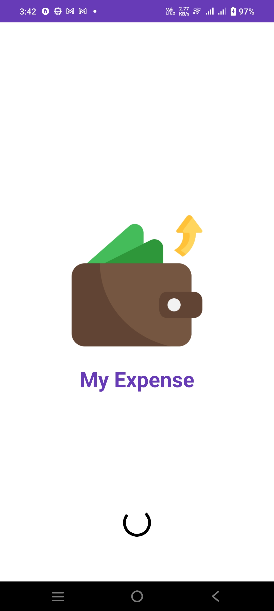
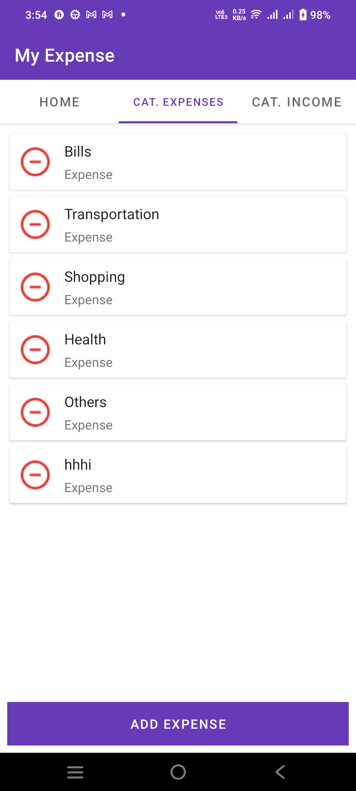
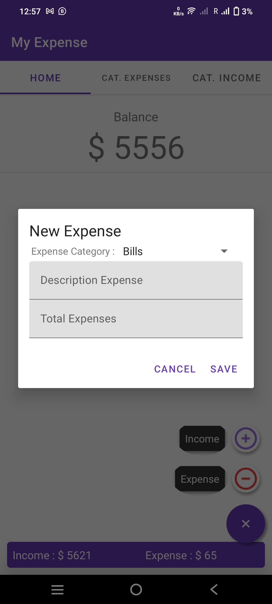
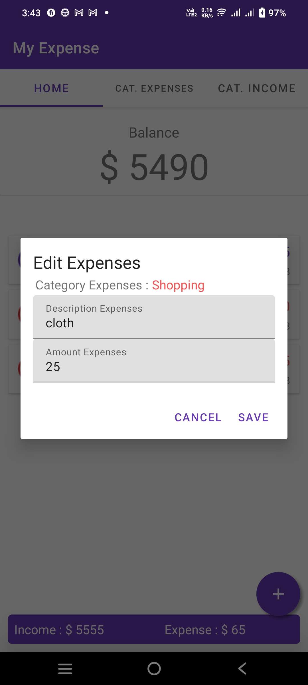
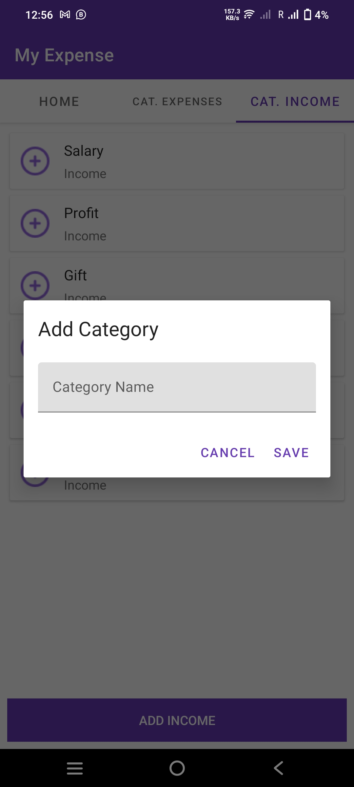
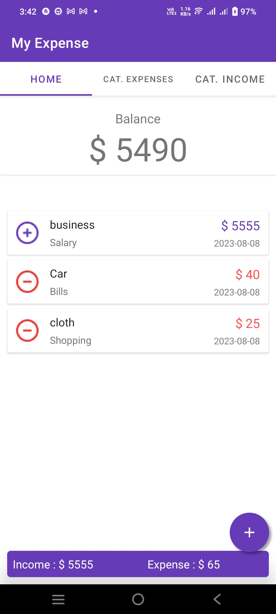

# My Expense App

This is an Android application built with Java using SQLite as the database. The app is designed to help users track and manage their income and expenses. It supports multiple categories for both income and expenses, allowing users to easily categorize, edit, and delete their financial transactions.

## Features

- **Expense Tracking**: Add, view, edit, and delete expenses categorized by type (e.g., shopping, bills, transportation, etc.).
- **Income Tracking**: Add and manage various sources of income such as salary, profit, gifts, etc.
- **Balance Calculation**: Displays a balance based on the difference between total income and total expenses.
- **Fragments & Activities**: The app is structured with multiple fragments for better user experience and navigation. Each category (income and expense) has its own fragment.
- **SQLite Database**: Stores all expense and income records locally in a SQLite database for persistent storage.

## Technologies Used

- **Android Studio**: Integrated Development Environment (IDE) for building the app.
- **Java**: The main programming language used to build the app.
- **SQLite**: The local database for storing income and expense data.
- **Fragments**: Used to manage different sections of the app, such as the home screen and categories.
- **Material Design**: For a clean and user-friendly UI/UX.


## App Screenshots

| **Splash Screen** | **Expenses Screen** | **Add Income/Expense** |
| --- | --- | --- |
|  |  |  |
| **Splash Screen**: The welcome screen when the app starts. | **Expenses Screen**: Displays the list of expense transactions with options to add or edit. | **Add Income/Expense**: Allows the user to add new income or expense records. |

---

| **Edit** | **Add Income/Expense Category** | **Home Screen** |
| --- | --- | --- |
|  |  |  |
| **Edit**: Interface to edit an expense or income, including selecting categories and entering amounts. | **Add Income/Expense Category**: Allows users to add custom categories for income and expenses. | **Home Screen**: Displays the balance, total income, and expenses, along with options to add new transactions. |


## Class Structure

Here is a list of the main classes in the app:

- **DataHelper**: Handles all database operations, such as inserting, updating, and deleting records.
- **ExpenseFragment**: Manages the user interface and logic for the expense-related functionality.
- **HomeFragment**: Displays the balance and income/expense summary.
- **IncomeFragment**: Handles the logic and UI for income-related transactions.
- **MainActivity**: The entry point for the app, which handles navigation between fragments.
- **Splashscreen**: Displays a loading or welcome screen on startup.
- **ViewPagerAdapter**: Used for managing page transitions between different views in the app.

## How to Run the App

1. Clone the repository:
   ```bash
   git clone https://github.com/Ahyan-Official/My-Expense.git


## License

MIT License

Copyright (c) 2024 Ahyan-Official

Permission is hereby granted, free of charge, to any person obtaining a copy
of this software and associated documentation files (the "Software"), to deal
in the Software without restriction, including without limitation the rights
to use, copy, modify, merge, publish, distribute, sublicense, and/or sell
copies of the Software, and to permit persons to whom the Software is
furnished to do so, subject to the following conditions:

The above copyright notice and this permission notice shall be included in all
copies or substantial portions of the Software.

THE SOFTWARE IS PROVIDED "AS IS", WITHOUT WARRANTY OF ANY KIND, EXPRESS OR
IMPLIED, INCLUDING BUT NOT LIMITED TO THE WARRANTIES OF MERCHANTABILITY,
FITNESS FOR A PARTICULAR PURPOSE AND NONINFRINGEMENT. IN NO EVENT SHALL THE
AUTHORS OR COPYRIGHT HOLDERS BE LIABLE FOR ANY CLAIM, DAMAGES OR OTHER
LIABILITY, WHETHER IN AN ACTION OF CONTRACT, TORT OR OTHERWISE, ARISING FROM,
OUT OF OR IN CONNECTION WITH THE SOFTWARE OR THE USE OR OTHER DEALINGS IN THE
SOFTWARE.
